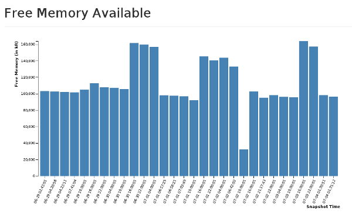

AvailableMemory
================

Application that chart the available memory on a server at regular intervals. 


##How To

Cron job is set up on your server like this: 

>00 06 * * * cd /home/web/memfree && sh memfree.sh

You can change the options to have it run however times you want of course. Your paths may differ as well. 

memfree.sh is very simple:

```
#!/bin/bash
cat /proc/meminfo | grep Pol > /home/web/Pol/memfree/$DATE-$TIME.txt
```
This simply dumps the current free memory info into a text file. 

The next cron job will call /jogs/checklog.php which will see if there are any new log files added,
and if they are they'll be stuffed into a mysql database. 

When you bring up the index of the website you'll see a chart rendered by D3 that looks like this:


